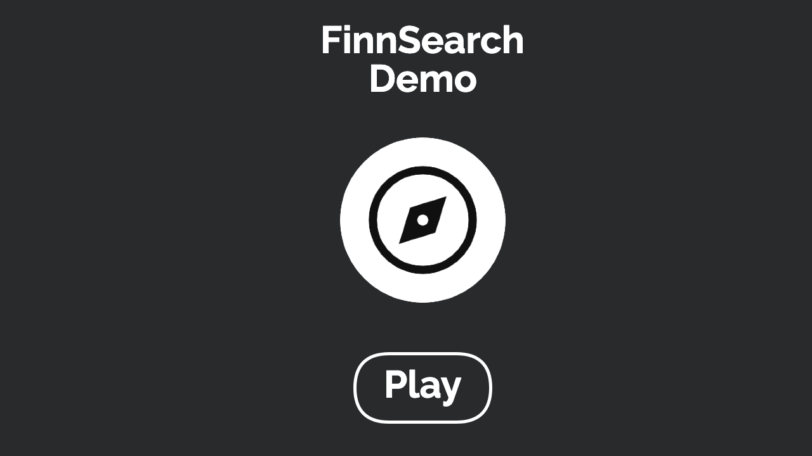

<h1 align = "center"> FinnSearch</h1>
<div align = "center">


</div>
<p align = "center"> Your simple guide to finding the ideal Finnish city. Explore using AI, our quiz, search, recommendations, or random selection, with all the data in one place  </p>
<p align = "center">
    <a href="#Features">Features</a> -
    <a href="#Technologies">Technologies</a> -  
    <a href="#Prerequisites">Prerequisites</a> -
    <a href="#Installation">Installation</a> -
    <a href="#Usage">Usage</a> -
    <a href="#Contributing">Contributing</a>
</p>

<div align = "center">

Demo version: [website](206.168.214.214/)

</div>
<p align="center">
  <a href="https://youtu.be/lTQXd2eFaNk">
    
  </a>
</p>


## Features:
- Dark/Light theme
- Finnish (fi) and English (eng) language support
- Responsive design
- AI City Match
- City Quiz Selection
- Matching Score Results
- City Search by name
- Random City Suggestion
- Detailed City Info (map, demographics, accessibility, etc.)
- Recommended City Categories

## Technologies
- Svelte
- JavaScript
- Tailwind CSS
- CSS


## Prerequisites
- Node.js and npm


## Installation
1. Clone the repo
```sh
git clone https://github.com/FinnSearch/FinnSearch-Web
```
2. Install dependencies
```sh
npm i or pnpm install
```
3. Update Endpoints in .env (if needed)


## Usage
```sh
cd FinnSearch-Web
npm/pnpm run dev
```


## Contributing
Contributions, issues and feature requests are welcome!

## License
This project is licensed under a [GPL-3.0 license](https://opensource.org/license/gpl-3-0)
